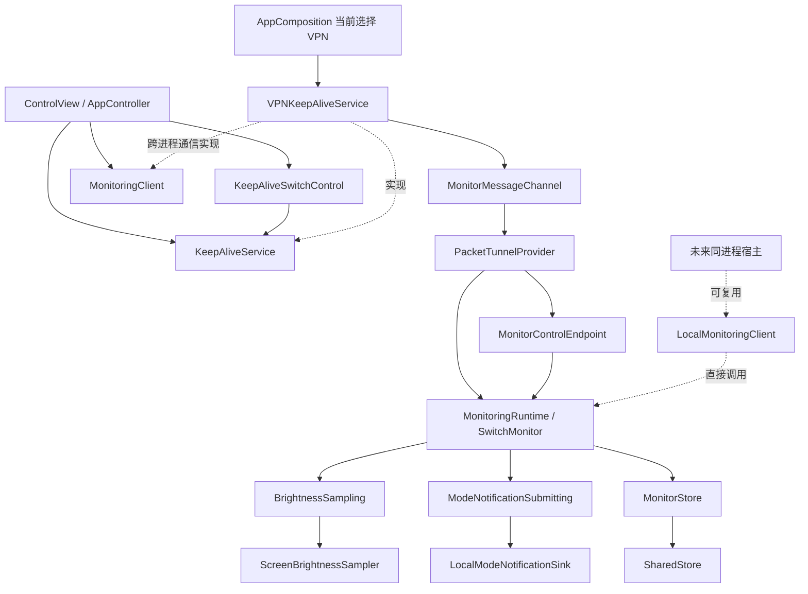

# 保活与切换监听的架构边界

本轮默认且唯一接入的保活后端仍是 VPN，没有创建 PiP 控制器、添加音频后台权限或开启高刷。切换监听继续在 Packet Tunnel 进程执行，外部快捷指令继续负责系统深浅色切换。

## 依赖关系

| 层 | 文件 / 接口 | 职责 |
| --- | --- | --- |
| 保活控制 | `Shared/ServiceContracts.swift` 中的 `KeepAliveService` | `refresh`、`updateState`、`prepare`、`start`、`stop` 和真实状态回调；不暴露 NetworkExtension 或 AVKit 类型 |
| 开关状态 | `Shared/KeepAliveSwitchControl.swift` | 准备阶段保存待开启意图，之后跟随真实保活状态；失败复位与重复操作保护，与具体后端无关 |
| 运行详情读取 | `Shared/MonitoringReadback.swift` | 区分可读取、暂不可读取和明确错误，控制自动重试；不把查询失败转换为保活或监听停止 |
| 当前 VPN 适配器 | `KeepAlive/VPNKeepAliveService.swift` | VPN 配置、重新启用、连接状态、断开错误、嵌入扩展校验；通过独立 `MonitoringClient` 接口提供跨进程控制 |
| VPN 运行载体 | `PacketTunnel/PacketTunnelProvider.swift` | 系统隧道设置、生命周期和组合依赖；调用监听的 start/stop/sleep/wake；不含评分、亮度读取或通知内容 |
| 监听业务 | `Monitoring/SwitchMonitor.swift` | 趋势评分与动态采样、候选、冷却、去重、心跳、统计、配置和通知结果持久化；仅依赖 Foundation 与接口 |
| 纯逻辑模型 | `Shared/ThresholdStateMachine.swift` 中的 `BrightnessTrendStateMachine` | v2 三项评分、一秒统一速度窗、稳定 / 反向起点、五档采样和 0.30 秒低速退出；全部时间由调用方注入 |
| 输入 / 输出 | `Platform/ScreenBrightnessSampler.swift`、`Platform/LocalModeNotificationSink.swift` | UIKit 主线程采样 / 事件 / 定时器，以及本地通知授权与提交 |
| 监听控制 | `MonitoringClient`、`MonitorControlEndpoint`、`LocalMonitoringClient` | 查询、配置确认和诊断导出；与保活启停分离 |
| 存储与协议 | `Shared/RuntimeStorage.swift` 等 | 配置、历史、快照、JSONL；通信版本 3，支持 `app-group-v1` 与 `local-ipc-v1` |
| 组合入口 | `App/AppComposition.swift` 和 Provider 中的一处运行时创建 | 当前选用 VPN，分别注入保活接口和监听控制接口 |

`extensionStarts` 为兼容既有快照保留字段名，现表示监听实例初始化次数。主 App 的前台定时刷新只读共享快照或查询扩展；不会向扩展提供亮度缓存。开关开启调用保活接口，VPN 适配器负责首次准备，关闭调用 stop；系统过渡阶段禁用重复点击，外部断开也会反映到开关。

## 存储与跨进程控制

App 组合入口先探测共享目录的打开与读写，选择一种模式并写入 VPN 元数据；Provider 严格使用该选择。模式和协议版本纳入握手，旧配置在停止状态下保存/重载后迁移。

| 模式 | 持久化与同步 |
| --- | --- |
| `app-group-v1` | 共用 App Group；App 保存配置，扩展保存运行快照、成功历史和监听日志；消息确认实际应用版本 |
| `local-ipc-v1` | AppRuntime / ProviderRuntime 分别位于各自私有容器；启动参数携带配置，运行时消息携带完整配置；App 缓存扩展返回的原始快照 |

本地模式下，配置消息必须带有效参数及匹配 revision。扩展的成功历史保存在 ProviderRuntime，系统重新拉起不会被主 App 的旧历史覆盖。由 App 开启时携带最新保存参数；系统重新拉起优先保留扩展保存的配置，首次初始化可使用 VPN profile 的初始参数。

查询不刷新采样心跳。App 停止连接后清除通信确认，本地缓存只代表上次获得的状态；不能直接访问扩展的私有文件。运行与 Boost 日志分别建立分页快照、同步与缓存，不宣称有界记录覆盖整个后台时段。Network Extension 的签名权限仍由系统验证。

## 运行与观测的边界

Provider start/stop 与独立监听不依赖 App 状态查询成功。`MonitorChannelError` 的 nil/timeout 归为 unavailable，界面以信息提示呈现，自动重试间隔为 30/60/120/300 秒；恢复回复或连接新会话后重置。手动查询不受退避限制。`runtimeConfirmed=false` 仅表示缺少当前身份/状态回复，不作为功能失效结论。

配置先保存，再尝试即时应用。无回复无法判断消息是否已被处理，显示“已保存，应用结果未知”；不宣称即时成功、不自动停止正常运行，App 重新开启时通过启动参数使用最新配置。扩展明确拒绝、坏 JSON、版本失配、非法参数和存储失败仍是可处理错误，不归入 unavailable。

事件回调、精确轮询间隔、sleep/wake 与完整日志覆盖用于诊断，不要求所有设备每次都产生所有记录。功能效果通过真实亮度条件、通知及外部切换观察；缺失观测保留未知，不生成心跳、样本或成功记录。

## 参考的 PiP 生命周期接口

参考仓库：[Yoroin/GlobalRefresh-PiP](https://github.com/Yoroin/GlobalRefresh-PiP)。本轮查看的提交为 `8004d96c9022a1ab281ef1a3beba2278ac6c024d`，代码见 [ViewController.swift](https://github.com/Yoroin/GlobalRefresh-PiP/blob/8004d96c9022a1ab281ef1a3beba2278ac6c024d/pip_swift/pip_swift/ViewController.swift)。其代码并没有可直接引入的统一保活协议，本项目参考其生命周期设计，未复制实现。

| 上游生命周期 | 本项目抽象 | 以后接入时的要求 |
| --- | --- | --- |
| `preparePiPInfrastructureIfNeeded`、`setupPip` | `prepare()` | 检查支持和资源准备；View / ContentSource 归 PiP 适配器所有 |
| `startPiPSmoothly`、`startPictureInPicture` | `start()` → starting | 只表示已请求启动，不能直接报 active |
| `pictureInPictureControllerDidStartPictureInPicture` | `onStateChange(active)` | 确认系统启动后，宿主才启动独立监听实例 |
| `pictureInPictureControllerWillStopPictureInPicture` | stopping | 宿主停止 / 暂停监听，清除采样心跳 |
| `pictureInPictureControllerDidStopPictureInPicture` | stopped | 包括用户关闭、其他 PiP 挤占；清理监听和 PiP 资源 |
| `failedToStartPictureInPictureWithError` | failed + lastError | 回传原始错误并清理部分初始化资源 |
| `teardownPiPInfrastructure` | 停止后的资源清理 | 不让定时器、观察者、播放器或旧回调存活 |
| `isPictureInPicturePossible` / `isPictureInPictureActive` | 准备可用性 / 真实状态 | 把系统实际状态与用户的启动意图区分开 |

未来 PiP 适配器放在 `KeepAlive/`，由 App 组合入口替换选择。监听实例在主 App 进程创建，可使用 `LocalMonitoringClient`，无需 Provider Message。PiP source view、尺寸、内容挂载和媒体控制均留在适配器 / 宿主，不进入 `SwitchMonitor`。暂停 / 恢复的宿主策略应调用 sleep/wake；终止后创建新的监听实例，继续从持久化历史恢复去重。

单独添加一个 PiP 保活类还不等于迁移完成：还需接入系统 delegate/KVO 状态、View 生命周期、后台权限、采样宿主和真机验收。后台 app scene 变化本身不能代替 PiP active/stopped 状态。VideoCall 内容容器与 PlayerLayer 是不同适配实现；高刷、静音音频、悬浮窗高度等不是切换监听的要求。[上游开发说明](https://github.com/Yoroin/GlobalRefresh-PiP/blob/8004d96c9022a1ab281ef1a3beba2278ac6c024d/DEVELOPMENT_PRD.md)

## 完整亮度日志

`Monitoring/BoostTraceRecorder.swift` 接在趋势模型每次进入动态采样之后，记录前 5 秒常规上下文与之后每次读取、评分和频率结果。独立按亮度连续 2 秒波动不超过 0.005 判定结束，恢复 1 Hz 不结束记录。Boost 按次写入紧凑记录，与运行日志各自导出、分页同步和持久缓存；快照的 `boostTraceIDs` 与活动记录保持一致。范围、中断与容量约定见 [BOOST_TRACE_LOG.md](BOOST_TRACE_LOG.md)。

## 生命周期约束

- start 先初始化持久化状态，再开始真实采样；初次状态无法保存时清理采样资源并返回失败。
- sleep/stop/reload 使旧采样回调失效，清除趋势起点与速度窗口。
- 变频通过 `BrightnessSampling.updateInterval` 只更新定时器，不重装观察者、不使在途通知授权回调失效；退出动态采样保留 baseline 与统一速度窗口。
- 通知权限返回后检查运行阶段、生命周期采样代次和 inFlight 请求身份；普通评分 / pendingTarget 变化不撤销该请求，生命周期失效仍可取消未提交请求。
- 已交给系统的通知请求允许完成，结果先持久化，再完成所有停止回调；重复或迟到回调不能重复调用 add。
- 候选生成不推进冷却。success / failed / blocked 以终态完成时间更新冷却；cancelled 保留此前冷却和历史，不增加实际提交 / 成功计数。
- query 和 handshake 只读快照，不更新心跳。心跳只来自真实采样。
- 配置落盘与应用确认是两件事；只有返回相同 revision 才显示应用成功。
- 共享存储失败时显式选择本地通信模式，并记录原因；两个私有目录通过消息同步，不视作共享文件。已选择共享模式时 Provider 不自行回退。
- 存储与启动错误以带具体描述的 NSError 跨进程返回，避免丢失实际失败原因。
