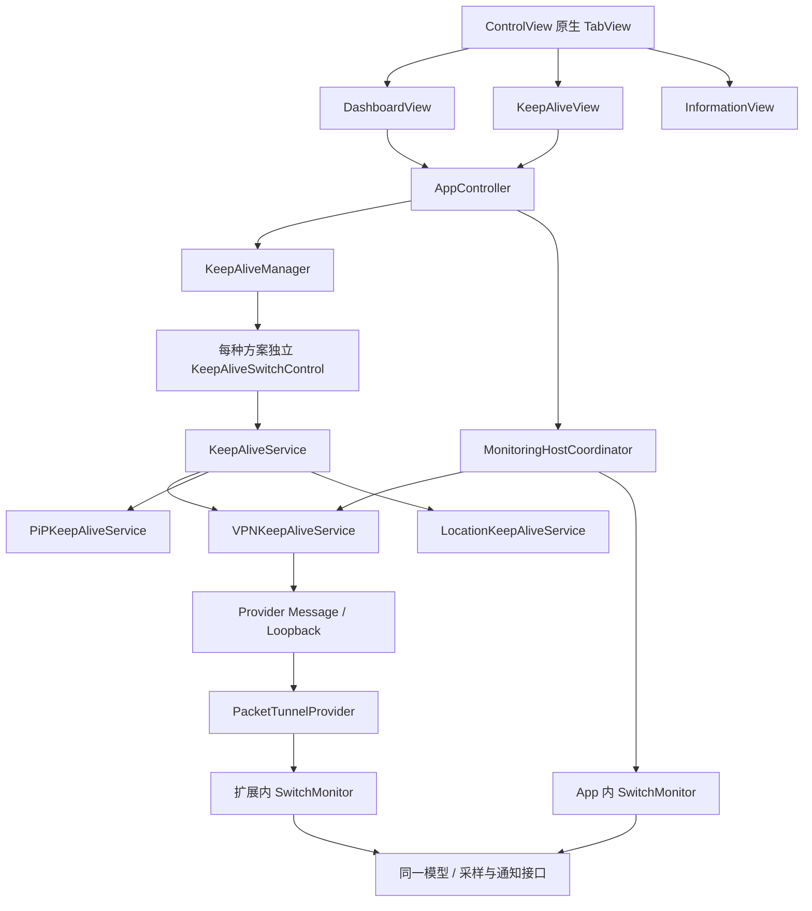

# 保活与切换监听的架构边界

当前接入 VPN、PiP 和 Location 三种独立保活方案，可以同时开启。`KeepAliveManager` 只管理注册、独立开关与平台状态；Auto Dark Shift 的配置、采样、通知和宿主选择在监听与 App 组合层。独立静音音频方案已按用户要求取消。具体平台行为和参考来源见 [KEEP_ALIVE.md](KEEP_ALIVE.md)。

## 依赖关系

| 层 | 文件 / 接口 | 职责 |
| --- | --- | --- |
| 一级 GUI | `App/ControlView.swift` | 原生底部 TabView；三个独立 View，各自 NavigationStack，共用原有 AppController |
| 仪表 | `App/DashboardView.swift` | 当前状态、Auto Dark Shift 开关、切换监听与通知统计二级入口 |
| 保活 / 信息 | `App/KeepAliveView.swift`、`App/InformationView.swift` | 三个独立开关 / 真实平台状态，以及版本信息 |
| 通用保活抽象 | `Shared/KeepAliveContracts.swift`、`KeepAliveManager.swift`、`KeepAliveSwitchControl.swift` | Foundation 接口与每种方案独立生命周期；不引用监听、模型、配置存储或通知业务 |
| 原生保活适配器 | `KeepAlive/` | VPN 系统配置和连接，PiP 内容源与 delegate，低精度后台定位与权限；原生框架只进入 App target |
| 监听宿主协调 | `Monitoring/MonitoringHostCoordinator.swift` | App 与 VPN 的监听选择、启停交接、已获取成功历史合并；不改变三种保活的独立开关 |
| 监听业务 | `Monitoring/SwitchMonitor.swift` | 原有模型 v2、采样、冷却、去重与双日志；新增独立 isEnabled 配置 |
| 输入 / 输出 | `Platform/ScreenBrightnessSampler.swift`、`Platform/LocalModeNotificationSink.swift` | 真实 UIKit 读数与通知提交，两种监听宿主复用 |
| 存储 / 控制 | `MonitorStore`、`MonitoringClient`、`MonitorControlEndpoint` | 配置确认、身份匹配、快照、历史与两路诊断；保留通信版本 3 |

VPN 连接、重连及断开过程中使用扩展宿主；其他时候使用 App 内宿主。由 App 发起 VPN 启动前，先停止本地采样，并等待已交给系统的通知完成及历史保存，然后才请求系统连接。由 App 关闭 VPN 时，先发送 `prepareHostHandoff` 停止扩展监听，等待 stopped 回复并合并最后历史，再同步日志及断开；连接实际停止后启动 App 内监听。两个方向都保留已取得的较新成功历史，避免用旧快照回退去重。系统从外部断开、强杀或读回不可用时，只能合并已取得的记录；未知结果保留在诊断中，不能宣称未读到的最终历史已同步。

没有 VPN 时，PiP / Location 支持的 App 后台运行承载同一个 App 内监听；二者同时开启不会创建两个监听。AppController 将前台状态及实际 active / reasserting 保活状态交给 MonitoringHostCoordinator 的本地执行策略。后台没有已确认保活时调用 sleep，取消采样并清空心跳；确认 PiP 已启动或回前台后 wake。后台创建本地宿主时先以禁用配置启动、进入睡眠，再恢复原配置，避免初次采样漏过限制；启动失败会停止该实例。此策略不改变 VPN 扩展，不把业务执行条件放进通用 KeepAlive 抽象。页面切换只影响显示，PiP 来源挂载于稳定根视图；UI 刷新仍只在前台运行。

Auto Dark Shift 的 `isEnabled` 与保活开关独立。关闭后取消采样与未提交候选、清除心跳，保留保活、成功历史和已有计数；已经交给系统的 add 仍记录实际完成结果。重新开启从新的观测基准开始。旧配置没有 isEnabled 字段时默认开启；保存开关发生在 VPN 启动中时，首次可读取后对比持久 revision 并补应用最新配置。

当前状态中的频率来自监听快照 `activePollInterval`，亮度来自采样快照，S 来自模型输出。外观来自 App 当前可见的系统 ColorScheme，不将 desiredTarget 或提交历史冒充系统其他 App 的实际外观。`extensionStarts` 保留旧字段名，表示监听实例初始化次数。

## 存储与跨进程控制

App 组合入口先探测共享目录的打开与读写，选择一种模式并写入 VPN 元数据；Provider 严格使用该选择。模式和协议版本纳入握手，旧配置在停止状态下保存/重载后迁移。

| 模式 | 持久化与同步 |
| --- | --- |
| `app-group-v1` | 共用 App Group；App 保存配置，扩展保存运行快照、成功历史和监听日志；消息确认实际应用版本 |
| `local-ipc-v1` | AppRuntime / ProviderRuntime 分别位于各自私有容器；启动参数携带配置，运行时消息携带完整配置；App 缓存扩展返回的原始快照 |

App 内监听的配置、快照、历史及双日志位于私有 `LocalMonitoring` 目录；不会把该目录当成扩展共享目录。App 内日志与 Provider 日志分开保留，导出时汇合对应流并保留来源，宿主切换不会用本地监听日志覆盖已同步的 Provider 缓存。

本地模式下，配置消息必须带有效参数及匹配 revision。扩展的成功历史保存在 ProviderRuntime，系统重新拉起不会被主 App 的旧历史覆盖。由 App 开启时携带最新保存参数及已获取的成功历史，Provider 只接受更新的历史；系统重新拉起优先保留扩展保存的配置，首次初始化可使用 VPN profile 的初始参数。

查询不刷新采样心跳。App 停止连接后清除通信确认，本地缓存只代表上次获得的状态；不能直接访问扩展的私有文件。运行与 Boost 日志分别建立分页快照、同步与缓存，不宣称有界记录覆盖整个后台时段。Network Extension 的签名权限仍由系统验证。

## 运行与观测的边界

Provider start/stop 与独立监听不依赖 App 状态查询成功。`MonitorChannelError` 的 nil/timeout 归为 unavailable，界面以信息提示呈现，自动重试间隔为 30/60/120/300 秒；恢复回复或连接新会话后重置。手动查询不受退避限制。`runtimeConfirmed=false` 仅表示缺少当前身份/状态回复，不作为功能失效结论。

配置先保存，再尝试即时应用。无回复无法判断消息是否已被处理，显示“已保存，应用结果未知”；不宣称即时成功、不自动停止正常运行，App 重新开启时通过启动参数使用最新配置。扩展明确拒绝、坏 JSON、版本失配、非法参数和存储失败仍是可处理错误，不归入 unavailable。

事件回调、精确轮询间隔、sleep/wake 与完整日志覆盖用于诊断，不要求所有设备每次都产生所有记录。功能效果通过真实亮度条件、通知及外部切换观察；缺失观测保留未知，不生成心跳、样本或成功记录。

## 完整亮度日志

`Monitoring/BoostTraceRecorder.swift` 接在趋势模型每次进入动态采样之后，记录前 5 秒常规上下文与之后每次读取、评分和频率结果。独立按亮度连续 2 秒波动不超过 0.005 判定结束，恢复 1 Hz 不结束记录。Boost 按次写入紧凑记录，与运行日志各自导出、分页同步和持久缓存；快照的 `boostTraceIDs` 与活动记录保持一致。范围、中断与容量约定见 [BOOST_TRACE_LOG.md](BOOST_TRACE_LOG.md)。

## 生命周期约束

- start 先初始化持久化状态，再开始真实采样；初次状态无法保存时清理采样资源并返回失败。
- sleep/stop/reload 使旧采样回调失效，清除趋势起点与速度窗口。
- 变频通过 `BrightnessSampling.updateInterval` 只更新定时器，不重装观察者、不使在途通知授权回调失效；退出动态采样保留 baseline 与统一速度窗口。
- 通知权限返回后检查运行阶段、生命周期采样代次和 inFlight 请求身份；普通评分 / pendingTarget 变化不撤销该请求，生命周期失效仍可取消未提交请求。
- 已交给系统的通知请求允许完成，结果先持久化，再完成所有停止回调；重复或迟到回调不能重复调用 add。
- 候选生成不推进冷却。success / failed / blocked 以终态完成时间更新冷却；cancelled 保留此前冷却和历史，不增加实际提交 / 成功计数。
- query 和 handshake 只读快照，不更新心跳。心跳只来自真实采样。
- 配置落盘与应用确认是两件事；只有返回相同 revision 才显示应用成功。
- 共享存储失败时显式选择本地通信模式，并记录原因；两个私有目录通过消息同步，不视作共享文件。已选择共享模式时 Provider 不自行回退。
- 存储与启动错误以带具体描述的 NSError 跨进程返回，避免丢失实际失败原因。
