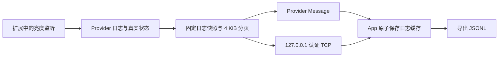

# PacketTunnel 日志回传与离线导出（build 9）

build 9 已拆除并归档轮询率测试，继续使用 build 8 修复的通用日志回传链路。旧测试版说明与源码见 [测试组件归档](../archive/polling-rate-test-build8-2026-10-02/README.md)。以下的旧日志证据保留用于说明回传修复的原因，当前复测使用普通监听。

## build 8 修复依据

输入为 `build/AutoDarkShift-13E966D5-3B87-413F-9447-128FD4A0717C.jsonl`，193 条记录，最终导出来自 build 7 / 协议 3 / iOS 27.0 / `local-ipc-v1`。原始文件不修改。

45 次 Provider Message 请求全部为空回复：22 次握手、9 次配置应用、5 次开始轮询测试、6 次停止测试、3 次日志导出。即使在保活连接期间主动导出，也没有取得扩展记录；最终一次导出发生在断开后。文件仅含 App 诊断与保存配置，没有 `sample`、`polling_window`、`polling_test_stage`、`polling_test_summary` 或真实 Provider 状态。

由此能确定控制与回传没有得到确认，不能证明逐档测试已启动，也不能证明扩展内没有写入结果。上一版只在 Provider 私有目录保存测试结果，导出仍依赖同一条失败的 Provider Message 链路，而且没有把取回的日志持久化到 App。这是 build 8 修复的链路缺口。

Apple 的 [sendProviderMessage 文档](https://developer.apple.com/documentation/networkextension/netunnelprovidersession/sendprovidermessage(_:responsehandler:))说明，发送消息或返回结果发生错误时会以 nil 通知调用者；nil 不提供具体权限错误或故障阶段。现有日志没有安装后的签名、描述文件或扩展入口记录，不能据此断言某个 API entitlement 是唯一根因。

## 当前路径

- 保留 Provider Message 作为首选通道。首次遇到 nil/超时后使用本机 TCP；切换成功后，本次 VPN 会话后续操作直接使用备用通道，避免每个日志页都等待失败重试。
- 新增与业务状态、存储和主线程处理无关的即时回显探针。它在 `handleAppMessage` 入口直接返回带随机编号的原始数据。探针也失败说明连即时回显都没有取回，应检查系统投递、VPN profile、安装签名/权限或 OS 行为；探针成功而业务消息失败则集中检查队列处理、编码和业务状态。探针提供定位证据，不自行宣称某个权限已经确认缺失。
- 使用实际 `NETunnelProviderSession.startTunnel(options:)` 启动扩展，并记录发送时的 session 类型、状态和 Provider Bundle ID。所有业务消息串行发送，避免自动查询与手动控制/导出重叠；新会话取消旧任务，旧回复不进入新会话。
- 备用监听只绑定 `127.0.0.1`，通过公开 [Network.framework](https://developer.apple.com/documentation/network) 的 NWListener/NWConnection 实现。端口与随机认证令牌保存在该 VPN profile 的 `providerConfiguration`，扩展启动读取同一份参数。令牌不写日志、不放入导出、不监听 LAN、不使用 Bonjour、不改变路由。未知令牌在执行任何控制操作前被拒绝。
- 消息使用 4 字节长度前缀，单帧最多 512 KiB，连接数/读取时间均有限制。状态与控制共用原有 `MonitorControlEndpoint`，仍验证 App 与扩展的实际运行身份。
- 日志导出使用 `exportDiagnosticPage`，每页最多 4096 原始字节，以 Codable Data 编码，避免切开中文 UTF-8。首次请求固定快照，后续偏移不会因日志追加或轮转而变化。最多保留四个导出快照、每个最多 512 KiB、120 秒有效。App 对总长度、偏移、完整 UTF-8 和每条 JSONL 进行校验；半份结果不会覆盖完整缓存。自动同步与手动导出合并同一进行中的任务。
- 回传包含 Provider 诊断尾部、真实监听快照、运行日志尾部，以及旧版本保留的测试结果文件。App 前台正常运行约每 15 秒同步，主动导出立即尝试同步。App 内关闭保活前也取回一次；随后关闭 VPN 仍可从 App 原子保存的 `provider-diagnostics.jsonl` 导出已获取记录。
- App 没有伪造亮度、采样或心跳。未曾获取扩展记录时导出明确包含 `provider_logs_missing`；同步失败时保留旧缓存，标记 `provider_logs_unavailable`，不会把 App 自己的日志当成扩展记录。

## 当前版本复测

1. 安装重签后的 build 9，关闭再开启一次保活，让当前 App 与扩展运行相同版本并更新本机通道参数。
2. 使用普通采样间隔，手动调整亮度并等待产生采样。前台运行约每 15 秒同步，也可主动导出立即取回。
3. 在连接时导出；应取得 `sample`、`provider_export_snapshot` 和 Provider 生命周期记录，并有 `provider_logs_cached` / `provider_logs_cache_export`。实际是否使用备用通道由 `loopback_message_received` 和 `monitor_message_confirmed.fields.transport` 记录。
4. 关闭保活后再次导出；已经同步的记录应继续存在，缓存获取时间和原采样时间不会改写。旧版留存的 `polling_test_stage` / `polling_test_summary` 仍可读取，但当前版本不再产生这些记录。
5. 若系统消息继续不可用，检查 `provider_message_probe_failed`；若备用通道也失败，日志保留 `bridgeUnavailable` 的具体连接错误。重新开启保活后可再次尝试取回扩展私有目录中的历史记录。

App 在后台且系统直接终止/关闭 VPN 时，无法保证同步尚未取回的最后部分；私有容器隔离仍然存在。设备系统如果拒绝本机监听/连接，也会有真实错误，不能用本机测试替代该设备验证。需要有效 Network Extension 签名能力才能启动 Provider，本机备用通道不会绕过系统对 VPN 的启动授权。

## 实际验证

当前回归覆盖原始探针与长度帧、串行发送/会话取消/备用切换、分页固定快照与 UTF-8/并发导出、持久化缓存完整性，以及真实 TCP 下普通配置应用、实际状态查询和监听日志进入离线导出文件。真实链路测试建立 127.0.0.1 连接并执行生产服务器、客户端、控制端点和存储实现，亮度输入使用模拟读数；同时验证错误认证令牌被拒绝。

本机默认命令沙箱禁止套接字监听；测试运行使用允许本机连接的执行权限。build 9 验证结果与日志见 [STATIC_VALIDATION.md](STATIC_VALIDATION.md)。用户已确认先前的轮询率测试完成，本次按要求归档；未执行 build 9 真机安装，因此当前本机验证只覆盖源码和本机日志链路。
